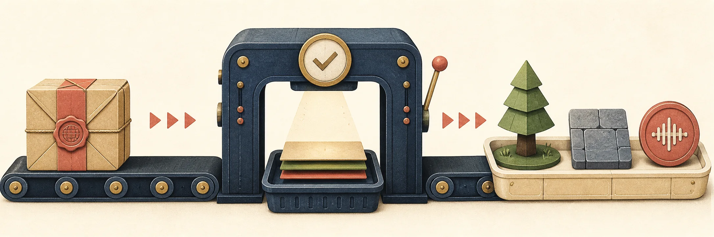

# asset-fetch



[](https://github.com/jbcom/asset-fetch/actions/workflows/ci.yml)
[](https://www.npmjs.com/package/asset-fetch)
[](LICENSE)

Find game assets across the sources you actually use, fetch them defensively, and promote a
deliberate subset into a project. `asset-fetch` is a typed Node.js library and CLI, not an MCP
server, built for local scripts and CI.

It unifies three workflows without pretending they share a trust or availability model:

- your owned itch.io library, including signed archive downloads;
- a read-only local SQLite catalog of 3D assets, as written by
  [game-asset-mcp](https://github.com/jbcom/game-asset-mcp); and
- public Poly Haven models, textures and HDRIs.

Downloads stream into private temporary locations, are verified by size and upstream MD5 when
available, then move into place atomically. Archive extraction and project promotion are staged
too, and every extraction is audited for entries that escape its directory, so partial or hostile
work never looks complete.

## Install

```sh
npm install asset-fetch
npx asset-fetch --help
```

Requires Node.js 22.16.0 or newer. The package ships native ESM and CommonJS entry points with
format-correct TypeScript declarations, and one runtime dependency
([`node-unrar-js`](https://www.npmjs.com/package/node-unrar-js)).

## Five-minute start

Search every configured backend. An unconfigured catalog or an absent itch cache becomes a warning;
results from healthy sources are still returned.

```sh
npx asset-fetch find "pine tree" --type=3d
npx asset-fetch find "studio lighting" --source=polyhaven --type=hdri --json
```

Fetch one Poly Haven model variant and the texture files it references:

```sh
npx asset-fetch polyhaven fetch ceramic_vase_03 \
  --resolution=1k --format=gltf --output=raw-assets/polyhaven
```

The files land under `raw-assets/polyhaven/ceramic_vase_03/`. A rerun skips files whose size and
MD5 still match.

## CLI reference

```text
asset-fetch find <query> [--source=itch|catalog|polyhaven|all]
                         [--type=audio|2d|3d|hdri|texture|tool|other]
                         [--limit=20] [--json]
asset-fetch polyhaven fetch <id> [--resolution=1k] [--format=gltf] [--output=<dir>]
asset-fetch itch library
asset-fetch itch search [query] [--bucket=audio|pixel-2d|3d-psx|tool|other]
asset-fetch itch download <allowlist.json> [--dry]
```

The top-level `library`, `search` and `download` names are aliases for their `itch` forms, so
`asset-fetch library && asset-fetch download allowlist.json` is the same as the `itch` spelling.
Commands reject unknown options and invalid values. Batch download and extraction commands exit
non-zero on partial failure.

### Owned itch.io assets

Create an itch.io API key, then expose it without committing it:

```sh
export ITCH_API_KEY=your-key
# or write ITCH_API_KEY=your-key to a gitignored .env in the working directory

asset-fetch itch library
asset-fetch itch search music --bucket=audio
asset-fetch itch download examples/allowlist.example.json --dry
asset-fetch itch download examples/allowlist.example.json
```

`itch library` paginates the owned-keys endpoint into `.itch-cache/library.json`. The allowlist is
a JSON array of exact owned pack titles. Downloads prefer archives and fall back to loose WAV, MP3,
OGG or FLAC files when a pack has no archive.

A key is 8 to 128 letters, digits, `.`, `_` or `-`. Anything else (a stray space, a newline, a
`KEY=value` prefix) is rejected before it can reach an `Authorization` header.

### Local 3D catalog

Unified search can read an existing SQLite catalog; it never ingests or changes it. The schema is
the one [game-asset-mcp](https://github.com/jbcom/game-asset-mcp) writes.

| Setting | Default | Override |
| --- | --- | --- |
| Asset root | none: required | `ASSET_FETCH_ASSETS_ROOT`, or the `assetsRoot` option |
| SQLite catalog | `~/.local/share/game-asset-mcp/catalog.db` | `ASSET_FETCH_CATALOG_DB`, or the `databasePath` option |

There is deliberately no default asset root: any default would be a path that exists on one
machine. Without one, `find` reports `catalog: Asset root is not configured` as a warning and the
library function `searchCatalog` throws the same message. The catalog default is where
game-asset-mcp writes its database, so the two tools agree out of the box. `CATALOG_DB` remains a
compatibility fallback for the database path. The connection uses Node's built-in `node:sqlite` in
read-only mode, and a missing path produces a structured warning instead of breaking an unrelated
workflow.

```sh
ASSET_FETCH_ASSETS_ROOT=/mnt/assets \
ASSET_FETCH_CATALOG_DB=/var/lib/assets/catalog.db \
asset-fetch find knight --source=catalog --type=3d
```

### Poly Haven

Search is public and requires no API key. Poly Haven assets are CC0, but use of the public API
itself is governed separately by Poly Haven's
[API terms](https://github.com/Poly-Haven/Public-API/blob/master/ToS.md), including its current
usage and attribution conditions. Review those terms for your use case. Powered by
[Poly Haven](https://polyhaven.com/).

The downloader accepts only HTTPS file URLs on Poly Haven's download hosts, pins every redirect to
HTTPS and the same host allowlist, and verifies the API's size and MD5 before replacing a
destination.

## Library API

### Unified discovery

```ts
import { findAssets } from "asset-fetch";

const { results, warnings } = await findAssets("pine tree", {
  sources: ["catalog", "polyhaven"],
  kind: "3d",
  maxResults: 12,
  catalog: { assetsRoot: "/mnt/assets" },
});
```

`findAssets` returns normalized `UnifiedAssetResult` rows and source-specific warnings. Itch results
need an `itchLibrary` array: call `fetchOwnedLibrary`, or deserialize a previously generated cache,
before using that source in library code.

### Source-specific APIs

- `fetchOwnedLibrary`, `searchLibrary`, `classifyPack` and `dedupeByGame` handle the owned itch.io
  library.
- `fetchItchAssets` downloads selected owned packs; `extractArchives` extracts ZIP, RAR and 7z
  sources into staging, audits them, and only then moves them into place.
- `searchCatalog` and `resolveAssetsRoot` query the game-asset-mcp SQLite schema with style,
  category, armature, texture and limit filters.
- `searchPolyhaven`, `listPolyhavenFiles` and `fetchPolyhavenAsset` cover Poly Haven discovery and
  verified transfer.
- `promoteAssets`, `listExtractedAudioFiles` and `writeAssetManifest` turn a project-specific
  selection into stable semantic slots.

### Safety primitives

The same guards the package applies internally are exported, for scripts that write alongside it:

```ts
import { assertExtractionContained, assertWithin, sanitizeKey } from "asset-fetch";

assertWithin("raw-assets/archives/pack.zip", ["raw-assets"]); // returns the resolved path, or throws
assertExtractionContained("raw-assets/.staging"); // throws if any entry or symlink escapes
sanitizeKey(process.env.ITCH_API_KEY); // the key, trimmed, or undefined
```

- `assertWithin(candidate, roots)` refuses a path outside every root. It is segment-aware, so a
  sibling directory that shares a string prefix with a root is outside.
- `assertExtractionContained(dir)` walks an extraction with `lstat`, resolves each entry's real path
  and throws on the first one outside `dir`. It never follows a symlink, and it refuses a symlink
  whose target cannot be resolved.
- `sanitizeKey(value)` and `KEY_PATTERN` define the one shape an itch.io key may have.

All public functions and option/result types are exported from the package root. See the
[architecture notes](./docs/ARCHITECTURE.md) for boundaries and trust decisions.

### Curating project assets

Promotion is intentionally a library operation: only the consuming project knows which downloaded
file should become `ambient-pad` or `player-hit`.

```ts
import { listExtractedAudioFiles, promoteAssets, writeAssetManifest } from "asset-fetch";

const files = listExtractedAudioFiles("raw-assets/extracted");
const result = promoteAssets({
  targetDir: "public/assets/audio",
  apply: true,
  normalize: true,
  slots: [
    { name: "ambient-pad", sources: files.filter((file) => file.includes("calm-loop")) },
    { name: "player-hit", sources: files.filter((file) => file.includes("impact")) },
  ],
});
writeAssetManifest("public/assets/audio", result.manifest);
```

Promotion is a dry run unless `apply: true` is supplied. Slot names, duplicate sources, extensions
and destination collisions are validated before mutation. Applying a plan removes stale numbered
variants and writes the manifest atomically. See the runnable [examples](./examples/).

## Platform requirements

The library and CLI support maintained Node.js 22, 24 and 26 releases on Linux, macOS and Windows.
The minimum is 22.16.0 because the shipped catalog uses the `node:sqlite` timeout option,
even when callers use only the remote sources. CI selects maintained majors, not exact patches. Optional
workflows need host tools:

- ZIP extraction: `unzip`
- 7z extraction: `7z`
- RAR extraction: bundled `node-unrar-js`
- audio loudness normalization: `ffmpeg`

Native `fetch` handles HTTP transfers; `curl` is not required. Paths are resolved with Node's
cross-platform APIs, and archive validation recognizes Unix absolute paths, Windows drive paths,
backslashes and parent traversal.

## Reliability and security

- Secrets and signed URLs are never logged. `ITCH_API_KEY` is read from the environment first and
  then a local `.env`, and shape-checked before use.
- Remote filenames cannot escape caller-selected directories: names are reduced to a basename,
  every write destination is checked with `assertWithin`, and every extraction is audited for
  escaping entries and symlinks before it replaces anything.
- Remote transfers use HTTPS, timeouts, bounded redirects, streaming writes and post-transfer
  integrity checks.
- Existing downloads, extractions and promoted assets survive failed retries.
- Catalog access is read-only and fail-soft; invalid caller options and a missing asset root still
  throw.
- Unified discovery preserves partial results and explains unavailable sources.

See [SECURITY.md](./SECURITY.md) for private vulnerability reporting and
[Troubleshooting](./docs/TROUBLESHOOTING.md) for common environmental failures.

## Development

```sh
mise install                 # or: corepack enable
pnpm install --frozen-lockfile
pnpm verify
```

`pnpm verify` runs Biome, Markdown linting, strict TypeScript, the behavioral tests with 100%
coverage of the core library, a clean ESM and CommonJS build, the runnable examples, `publint`, Are
The Types Wrong, and a packed-tarball check that installs the tarball from npmjs alone and imports it
under both module systems.

Contributions are welcome. Read [CONTRIBUTING.md](./CONTRIBUTING.md), the
[Code of Conduct](./CODE_OF_CONDUCT.md) and the issue templates before opening a pull request.

## Releases and license

Conventional commits drive release-please. Merging its release pull request creates a GitHub
release, and the `publish` job in `cd.yml` rebuilds, verifies and publishes the exact tag to npm
with provenance, through npm trusted publishing.

Licensed under the [MIT License](./LICENSE).
